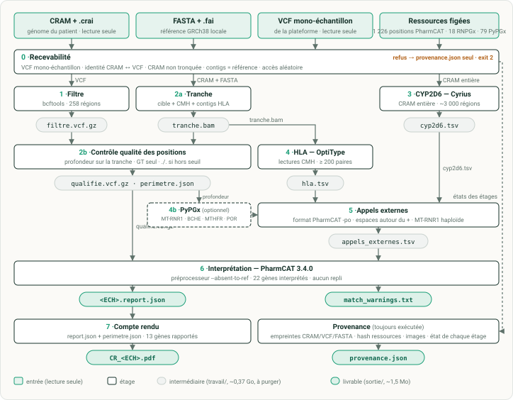
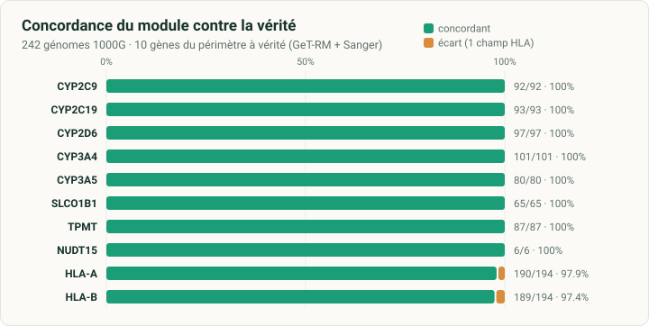
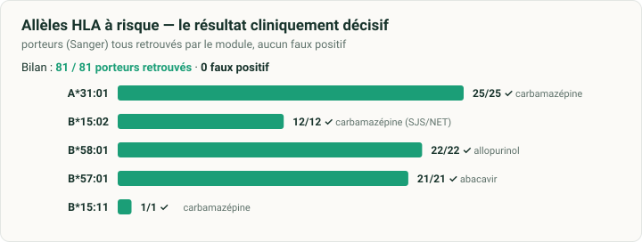
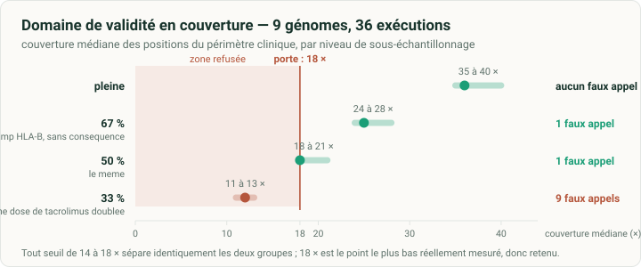
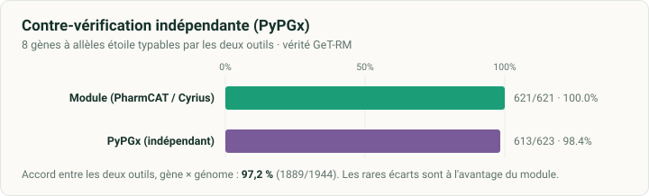
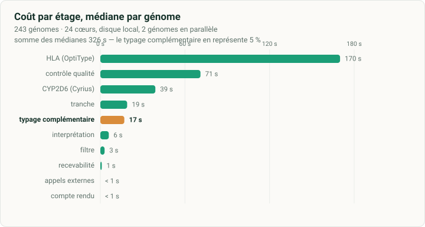
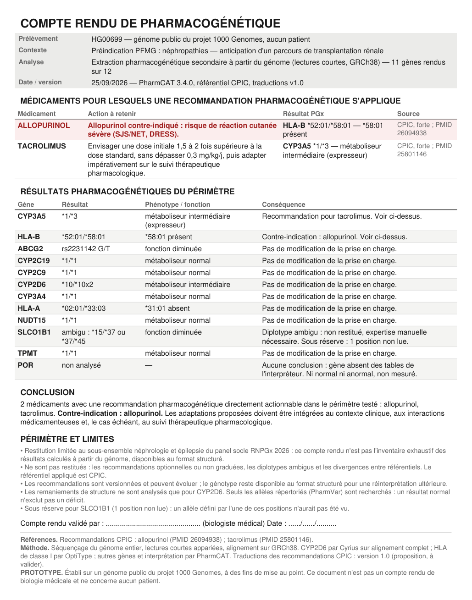
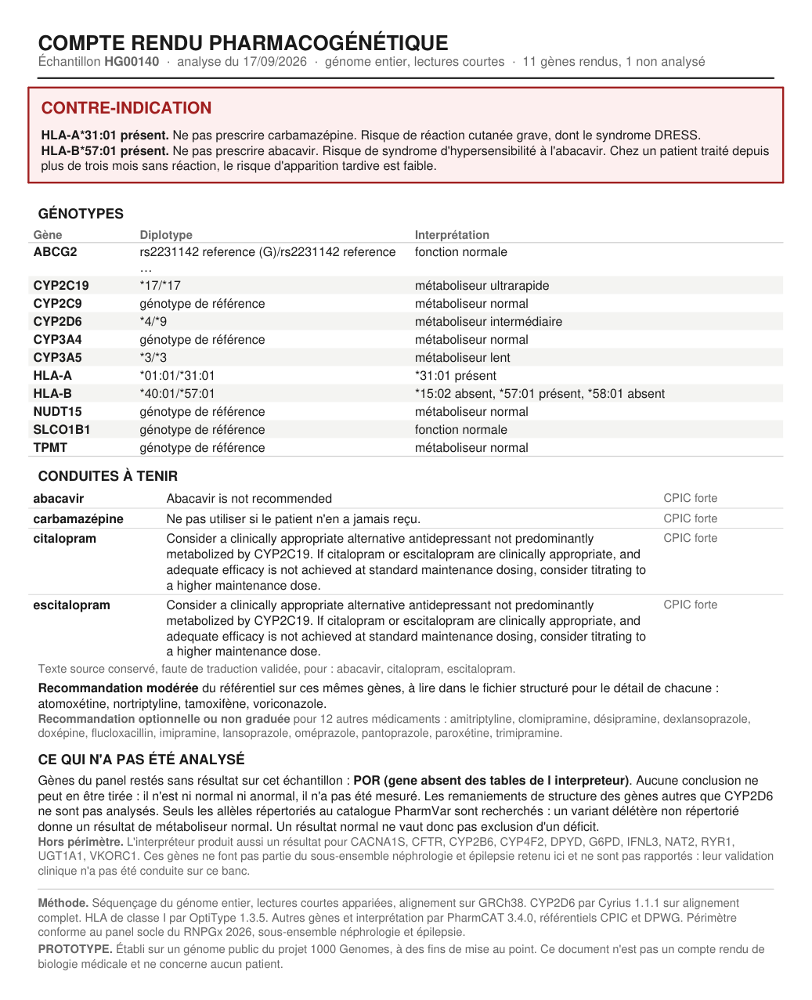

# pgx-genome

Module de pharmacogénétique pour génome entier. Il lit un génome déjà séquencé et
aligné, et rend un avis pharmacogénétique sur treize gènes. Il ne demande ni
nouveau prélèvement, ni nouvelle course de séquençage, ni réalignement, ni second
appel de variants : il se branche en aval d'un pipeline de séquençage existant.

Règle de conception unique : **aucun résultat faux ne sort sans être signalé**.
Chaque étage teste son code de retour, inscrit son état, et refuse de se rabattre
sur une entrée de secours. Le code de retour du module ne vaut zéro que si les
neuf étages requis ont abouti. Le typage complémentaire (4b) est optionnel : non
armé, il ne pèse pas sur ce résultat ; armé, son échec compte comme celui d'un
autre étage.

## Ce qu'il fait

À partir d'un alignement (CRAM/BAM) et d'un fichier de variants (VCF), il produit
pour un génome :

- un avis structuré exploitable par une machine (`report.json`) ;
- un compte rendu en français, médicaments concernés en tête (`CR_<ECH>.pdf`) ;
- une trace d'exécution complète (`provenance.json`).

Il couvre le sous-ensemble néphrologie et épilepsie du panel socle RNPGx 2026 :
CYP2C9, CYP2C19, CYP2D6, CYP3A4, CYP3A5, SLCO1B1, TPMT, NUDT15, ABCG2, MT-RNR1,
et HLA-A, HLA-B. POR est dans le périmètre sans table clinique : il sort en allèle
nommé, sans phénotype.

**Positions complémentaires du core panel.** 18 positions de classe 1 et 2 du core
panel RNPGx 2026 sont absentes des définitions de l'interpréteur : BCHE, MT-RNR1,
MTHFR, GGCX, TYMS, POR, le cluster CYP2C, et trois positions de NAT2 et VKORC1.
Elles sont **extraites, contrôlées et rendues en génotype**, mais **aucune n'est
interprétée** : pas de phénotype, pas de recommandation. Le VNTR de TYMS n'étant pas
génotypable en lectures courtes, seule sa couverture est mesurée.

Quatre outils font le travail biologique, orchestrés par un script bash :

| Étape | Outil |
|---|---|
| CYP2D6 (duplications, hybrides) | Cyrius, sur l'alignement complet |
| HLA de classe I | OptiType, sur les lectures du complexe majeur |
| MT-RNR1, BCHE, MTHFR, POR | PyPGx, sur les régions de ces gènes |
| Les autres gènes et l'interprétation | PharmCAT |

**Typage complémentaire (4b, optionnel).** Quatre gènes du core panel échappent à
l'interpréteur ; PyPGx les type. Un gène n'est rendu que si toutes ses positions
définissantes ont été lues et qualifiées — sinon non conclusif, jamais
« référence ».

| Gène | Ce qui sort |
|---|---|
| MT-RNR1 | allèle en appel externe → phénotype et recommandation CPIC (aminosides) |
| BCHE, MTHFR, POR | allèle nommé, sans interprétation |

Un étage de contrôle qualité maison, en amont de PharmCAT, distingue « position
lue, identique à la référence » de « position non séquencée ». C'est ce qui évite
que PharmCAT rende un génotype de référence sur une position simplement absente du
fichier.

Flux de fichiers pour un génome (détail étage par étage : `doc/FLUX_FICHIERS.md`) :

<p align="center"></p>

## Validation

Le module a été mesuré sur **246 génomes publics** du 1000 Genomes Project (jeu
haute couverture NYGC, aligné sur GRCh38), pour lesquels une vérité indépendante
existe : les diplotypes de référence **GeT-RM** (CDC) pour les gènes à allèles
étoile, et le **typage HLA par séquençage Sanger** (Gourraud *et al.*, 2014) pour
HLA-A et HLA-B.

**Recevabilité et complétude.** Sur 246 génomes soumis, 3 sont refusés à l'entrée
— deux alignements tronqués, un aligné sur le mauvais assemblage — et les 243
recevables sont menés au bout des neuf étages, soit **242 / 243** en réussite
complète (un seul avec un échec CYP2D6 isolé, signalé comme tel). Les trois refus
sont le comportement attendu : les contrôles d'entrée les écartent *avant* de
lancer un seul étage, plutôt que de rendre un résultat faux sur une entrée
corrompue.

**Concordance sur les 12 gènes du périmètre pour lesquels une vérité existe : 1000 / 1009 = 99,1 %.** Les
neuf écarts sont tous des quasi-concordances HLA à quatre chiffres (un champ sur
deux), aucun sur un allèle à risque.

| Gène | Concordance | | Gène | Concordance |
|---|---|---|---|---|
| CYP2C9 | 92 / 92 (100 %) | | SLCO1B1 | 65 / 65 (100 %) |
| CYP2C19 | 93 / 93 (100 %) | | TPMT | 87 / 87 (100 %) |
| CYP2D6 | 97 / 97 (100 %) | | NUDT15 | 6 / 6 (100 %) |
| CYP3A4 | 101 / 101 (100 %) | | HLA-A | 190 / 194 (97,9 %) |
| CYP3A5 | 80 / 80 (100 %) | | HLA-B | 189 / 194 (97,4 %) |

POR et ABCG2 sont dans le périmètre mais sans vérité sur ce banc.

<p align="center"></p>

**Allèles HLA à risque — le résultat cliniquement décisif : les 81 porteurs sont
tous retrouvés, sans faux positif.** La cohorte est enrichie en porteurs d'allèles
à risque, surreprésentés par rapport à leur fréquence en population.

| Allèle | Médicament | Porteurs | Retrouvés |
|---|---|---|---|
| A\*31:01 | carbamazépine | 25 | 25 |
| B\*15:02 | carbamazépine (SJS/NET) | 12 | 12 |
| B\*58:01 | allopurinol | 22 | 22 |
| B\*57:01 | abacavir | 21 | 21 |
| B\*15:11 | carbamazépine | 1 | 1 |

Les quatre écarts HLA-A et les cinq HLA-B portent sur le second champ d'un allèle
sans conséquence de prescription (par ex. `*02:01` rendu `*02:07`) — le détail
gène par gène est en [annexe](#annexe--les-neuf-écarts-hla-en-détail).

<p align="center"></p>

**Couverture.** Positions diagnostiques couvertes : médiane 99,7 %, minimum 85,3 %
(un génome à couverture plus basse, ses positions douteuses signalées). Aux seuils
par défaut (GQ ≥ 20, profondeur ≥ 10×), 88 % des couples
gène × génome sont complets ; le reste est rendu « partiel » et signalé comme tel,
jamais rabattu sur une référence.

**Domaine de validité en couverture.** 9 génomes sous-échantillonnés à quatre
niveaux, 36 exécutions. Jusqu'à **18 ×** de couverture médiane sur le périmètre,
aucun allèle à conséquence clinique n'est perdu ; à 11 ×, neuf faux appels
apparaissent, dont un qui ferait doubler une dose de tacrolimus chez un
métaboliseur lent. **Un génome sous 18 × est donc refusé** — code de sortie 2,
aucun compte rendu — et la couverture mesurée figure sur le document.

<p align="center"></p>

**Contre-vérification indépendante (PyPGx).** Les gènes à allèles étoile que PyPGx
sait typer ont été appelés en parallèle par PyPGx sur les **244 génomes**, sur les
mêmes entrées (avec le nombre de copies pour CYP2D6, calibré sur le gène de contrôle
VDR). Les deux outils s'accordent sur **97,2 %** des couples. Contre la vérité
GeT-RM, le module est à **100 % (621 / 621)** et PyPGx à **98,4 % (613 / 623)** ; les
rares écarts sont à l'avantage du module (CYP2D6, SLCO1B1, NUDT15), qui s'abstient ou
tranche par classe de fonction là où PyPGx force un appel. En sens inverse, PyPGx
type **POR** — 129 porteurs de `*28` sur les 244 — que l'interpréteur ne couvre
pas. C'est ce constat qui a conduit à en faire un étage du module plutôt qu'un
outil de comparaison (voir ci-dessous).

<p align="center"></p>

**Typage complémentaire (étage 4b).** Les quatre gènes que l'interpréteur ne
sait pas appeler ont été typés sur **243 génomes**. Aucune vérité externe
n'existe pour eux ; la mesure de référence est le génotype relevé position par
position par le contrôle qualité, sur un chemin technique indépendant — l'un lit
l'alignement et sa profondeur, l'autre le seul fichier de variants.

| Gène | Rendus | Non conclusifs | Concordance avec la mesure |
|---|---|---|---|
| MT-RNR1 | 242 / 243 | 1 (contig `chrM` absent du fichier de variants) | aucun porteur sur ce banc |
| BCHE | 243 / 243 | 0 | 243 / 243 sur ses deux positions |
| MTHFR | 243 / 243 | 0 | 243 / 243 sur C677T et A1298C |
| POR | 243 / 243 | 0 | 243 / 243 sur `rs1057868` |

Les fréquences alléliques observées rejoignent les valeurs publiées : BCHE
`rs1803274` 0,18 contre 0,20 attendu, MTHFR C677T 0,35 contre 0,33. Le gène non
conclusif est le comportement voulu : sans le contig mitochondrial dans le
fichier de variants, le typeur rendrait « référence » — donc « risque normal de
surdité sous aminoside » — sur un gène jamais lu.

**Limite à connaître : MT-RNR1 n'a aucun porteur sur ce banc.** Ses trois
positions du panel — m.1095T>C, m.1494C>T, m.1555A>G — sont de référence sur les
243 génomes. Le gène porte pourtant toute la valeur clinique de l'étage, puisque
c'est le seul à rendre un phénotype et une recommandation. L'appel négatif est
donc vérifié 242 fois, l'appel positif pas une seule : la recommandation
« éviter les aminosides » n'a jamais été déclenchée par une donnée réelle, mais
seulement sur appel construit.

**Cinq garde-fous éprouvés.** Chacun a été déclenché sur un génome réel et
refuse le seul gène concerné, jamais le génome : contig absent du fichier de
variants, profondeur non mesurée, profondeur sous le seuil, génotype sans GQ,
`FILTER` autre que `PASS`.

**Coût mesuré** sur les 243 génomes, vingt-quatre cœurs, données sur disque
local, deux génomes en parallèle :

| Étage | Médiane | p90 | Max |
|---|---|---|---|
| recevabilité | 1 s | 2 s | 2 s |
| filtre | 3 s | 4 s | 5 s |
| tranche | 19 s | 24 s | 33 s |
| contrôle qualité | 71 s | 75 s | 113 s |
| CYP2D6 | 39 s | 51 s | 86 s |
| HLA | 170 s | 209 s | 306 s |
| typage complémentaire | 17 s | 20 s | 35 s |
| appels externes | < 1 s | < 1 s | 1 s |
| interprétation | 6 s | 7 s | 15 s |
| compte rendu | < 1 s | 1 s | 1 s |

<p align="center"></p>

Le HLA domine le temps d'exécution ; le typage complémentaire pèse **5 % des
326 secondes** de la somme des médianes.

Le banc de validation lui-même — cohorte, vérités, scripts de comparaison — n'est
pas versionné dans ce dépôt de production ; il est reproductible à partir des
données publiques citées.

## Prérequis

Sur la machine qui exécute le module :

| Dépendance | Version | Rôle |
|---|---|---|
| Linux ou WSL2 | — | l'environnement |
| `bash` | ≥ 4 | l'orchestrateur |
| `docker` | ≥ 20 | les conteneurs |
| `pypgx` | image 0.27.0 | l'étage 4b, optionnel (`PGX_PYPGX`) ; image construite sur place, voir `env/pypgx.Dockerfile` |
| `samtools` | ≥ 1.13 | tranche, profondeur, extraction du complexe majeur |
| `python3` | ≥ 3.8, avec `reportlab` | contrôle qualité, provenance, compte rendu |
| GNU coreutils / findutils | — | `stat -c`, `xargs -d` pour le traitement de lot |
| dépôt Cyrius | commit `7c060db` | l'étage CYP2D6 (apporte ses propres dépendances Python) |

Deux ressources externes, volumineuses, non versionnées dans ce dépôt :

- **La référence GRCh38.** Celle qui a servi à l'alignement, indexée (`.fai`).
  Ce banc utilise `GRCh38_full_analysis_set_plus_decoy_hla.fa` (assemblage NYGC du
  1000 Genomes). Un CRAM en exige une.
- **Le dépôt Cyrius.** Cloné et épinglé au commit ci-dessus.

Les images sont épinglées par étiquette **et** par empreinte immuable dans
`env/conteneurs.txt`. Un changement de version change les résultats et doit être
remesuré : `doc/VALIDATION.md` donne le protocole.

**Le moteur de conteneurs est interchangeable.** `docker` par défaut,
`apptainer` ou `singularity` par `PGX_MOTEUR` — les plateformes de calcul qui
n'autorisent pas de démon privilégié disposent du second.

Deux réglages mesurés sur ce banc :

| Réglage | Pourquoi |
|---|---|
| Sortie sur disque local | 1 361 Mo/s contre 99 sur un disque Windows monté sous WSL2, et 60× plus lent sur les petits fichiers ; le module écrit 150 Mo par génome |
| `--parallele 2` en lot | OptiType lance `razers3` sur seize threads : 5 génomes en 8 min à deux en parallèle, 1 en 45 min à six |

## Installation

```bash
git clone <url-de-ce-depot> pgx-genome
cd pgx-genome
pip install -r env/requirements.txt

# Cyrius, épinglé
git clone https://github.com/Illumina/Cyrius.git /opt/Cyrius
git -C /opt/Cyrius checkout 7c060db
pip install -r /opt/Cyrius/requirements.txt

# les trois conteneurs (voir env/conteneurs.txt pour les empreintes)
docker pull quay.io/biocontainers/bcftools:1.24--h118bc1c_2
docker pull pgkb/pharmcat:3.4.0
docker pull quay.io/biocontainers/optitype:1.3.5--hdfd78af_3
```

Deux variables d'environnement pointent la référence et Cyrius :

```bash
export PGX_FASTA=/chemin/GRCh38_full_analysis_set_plus_decoy_hla.fa
export PGX_CYRIUS=/opt/Cyrius
```

## Utilisation

Un génome :

```bash
bin/pgx_genome.sh \
  --cram    /chemin/echantillon.cram \
  --vcf     /chemin/echantillon.vcf.gz \
  --sortie  /chemin/resultats/echantillon \
  --echantillon ECH001
```

Un lot, avec tableau de bord :

```bash
bin/pgx_lot.sh --manifeste liste.tsv --sortie /chemin/resultats --parallele 4
```

Le manifeste porte trois colonnes séparées par des tabulations : identifiant,
chemin de l'alignement, chemin du fichier de variants. Un exemple est dans
`exemples/manifeste.exemple.tsv`. Un échantillon déjà complet est sauté.

Les options complètes (`--gq`, `--profondeur`, `--fils`, `--reprise`, `--forcer`)
sont décrites dans `doc/MODE_EMPLOI.md`.

## Entrées et sorties

| Entrée | Contrainte |
|---|---|
| Alignement | CRAM ou BAM indexé, GRCh38, le même que celui du rendu diagnostique |
| Variants | VCF d'un seul échantillon, GRCh38, avec `GT`, `GQ`, `DP` |
| Référence | FASTA indexé, celle de l'alignement, obligatoire pour un CRAM |

Le module **refuse à l'entrée**, sans lancer aucun étage : un VCF multi-échantillon,
une identité qui ne concorde pas, un alignement tronqué, un alignement sur un
autre assemblage, un alignement sans index lisible.

| Sortie | Contenu |
|---|---|
| `sortie/<ECH>.report.json` | l'avis complet, structuré |
| `sortie/CR_<ECH>.pdf` | le compte rendu (une page ; deux si les recommandations sont nombreuses) |
| `sortie/provenance.json` | entrées, empreintes, versions d'images, seuils, état de chaque étage |
| `travail/perimetre.json` | par gène : positions attendues, retenues, perdues, statut |
| `travail/qc_positions.tsv` | une ligne par position diagnostique, ce qui a été lu |

`provenance.json` porte le champ `reussite_complete`, vrai seulement si les neuf
étages sont présents et qu'aucun n'est en échec. C'est le champ qu'une plateforme
surveille.

Exemple de compte rendu positif, contexte « néphropathies » : HG00699, génome public du
1000 Genomes, porteur de HLA-B\*58:01 (concordant avec le typage Sanger) et de CYP3A5 \*1/\*3.
Les traductions des recommandations CPIC n'ont pas de validation pharmacologique.

<p align="center"></p>

Second exemple, contexte « épilepsie » : HG00140, porteur de HLA-A\*31:01 et HLA-B\*57:01,
deux allèles concordants avec le typage Sanger.

<p align="center"></p>

## Traçabilité

Chaque exécution enregistre dans `provenance.json` : l'empreinte des entrées, le
digest immuable des trois images Docker, le commit de Cyrius, les empreintes des
ressources, les seuils, et l'état de chaque étage. Deux exécutions à provenance
identique produisent le même résultat.

## Ce que le module ne fait pas

- **POR** n'a pas de table dans l'interpréteur : il sort toujours « non analysé ».
- **Les remaniements de structure** ne sont analysés que pour CYP2D6.
- **Seuls les allèles répertoriés** au catalogue de référence sont recherchés ;
  un variant délétère non répertorié donne un métaboliseur normal.
- Le module **prépare, il ne signe pas** : il ne remplace pas la validation
  biologique.

## Structure du dépôt

```
bin/            les huit scripts du pipeline
ressources/     les ressources figées, lues au runtime (dont les traductions CPIC)
outils/         les générateurs de ressources, les contrôles, les crochets
tests/          139 cas, audités par mutation
doc/            le mode d'emploi complet et le schéma du flux de fichiers
env/            requirements Python et empreintes des conteneurs
exemples/       un manifeste type
bench/          la fiche de résultats condensée (une ligne par gène)
```

`doc/MODE_EMPLOI.md` est le manuel de référence, étage par étage, avec la
justification de chaque garde-fou. `doc/FLUX_FICHIERS.md` décrit le cheminement
des fichiers d'un bout à l'autre. `doc/VALIDATION.md` rassemble les preuves, les
limites à déclarer et le protocole de revalidation. `exemples/pgx_genome.nf` est
une recette d'intégration pour un ordonnanceur, à adapter.

**L'identité du patient se passe dans un fichier**, par `--identite`, et non en
argument : un argument est lisible dans la table des processus par tout
utilisateur de la machine, et se retrouve dans les journaux de l'ordonnanceur.

## Annexe — les neuf écarts HLA en détail

Tous en HLA, tous « un allèle sur deux » (le premier juste, le second qui diffère),
aucun sur un allèle à risque — là où un allèle à risque est présent, il est juste
(NA18980, A\*31:01).

| Prélèvement | Gène | Module rend | Vérité Sanger | Allèle discordant | Impact prescription |
|---|---|---|---|---|---|
| NA18552 | HLA-A | \*02:07 / \*11:01 | \*02:01 / \*11:01 | 02:07 vs 02:01 | aucun |
| NA18966 | HLA-A | \*02:06 / \*02:07 | \*02:01 / \*02:06 | 02:07 vs 02:01 | aucun |
| NA18980 | HLA-A | \*11:02 / **\*31:01** | \*11:01 / **\*31:01** | 11:02 vs 11:01 | aucun — **A\*31:01 juste** |
| NA19007 | HLA-A | \*02:07 / \*26:03 | \*02:01 / \*26:03 | 02:07 vs 02:01 | aucun |
| HG01190 | HLA-B | \*18:01 / \*35:28 | \*15:20 / \*18:01(/18:17N) | 35:28 vs 15:20 | aucun |
| NA10854 | HLA-B | \*27:05 / \*44:02 | \*44:02 / \*27:03 | 27:05 vs 27:03 | aucun |
| NA11832 | HLA-B | \*27:05 / \*40:02 | \*40:02 / \*27:03·09·51·52 | 27:05 vs 27:0x | aucun (**vérité ambiguë**) |
| NA19327 | HLA-B | \*45:01 / \*82:02 | \*45:01·45:07 / idem | 82:02 vs 45:07 | aucun (**vérité ambiguë**) |
| NA19917 | HLA-B | \*08:01 / \*15:03 | \*15:03·15:103 / \*41:02 | 08:01 vs 41:02 | aucun |

Ils se concentrent sur les familles **A\*02** et **B\*27**, dont les sous-types ne
diffèrent que de 1–2 SNP souvent hors des exons typés par OptiType, sur une référence
GRCh38 linéaire pour une région multi-haplotype ; deux des vérités Sanger sont
elles-mêmes ambiguës. **Le premier champ — l'allèle à risque — est résolu (81/81,
0 faux positif) ; l'écart porte sur le second champ, sans impact de prescription.**

## Licence

[PolyForm Strict 1.0.0](https://polyformproject.org/licenses/strict/1.0.0) — © 2026 Victor Marin.
Usage non commercial uniquement ; ni modification ni redistribution. Voir `LICENSE`
et, pour les composants tiers (MPL-2.0), `NOTICE`.
